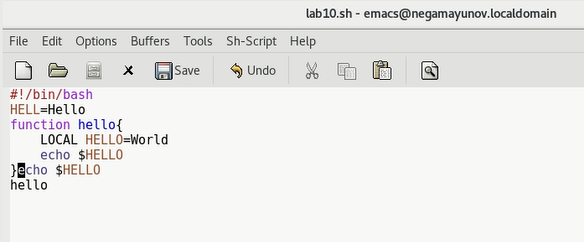
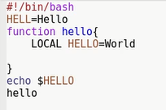
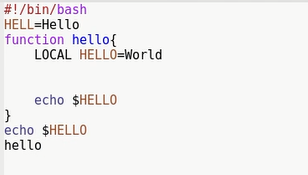
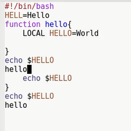

<!-- _class: titleslide -->
# Лабораторная работа №10
### Выполнил Гамаюнов Никита, 1032201719, НПМбд-01-20

---
# Прагматика выполнения работы
**Цель:** Познакомиться с операционной системой Linux. Получить практические навыки работы с редактором Emacs.

**Задача:** Ознакомиться с теоретическим материалом, с редактором emacs, выполнить упражнения, ответить на контрольные вопросы.

---

# Процесс выполнения работы

1. Открыл Emasc, Создал файл `lab07.sh` с помощью комбинации `C-x C-f`, набрал текст и сохранил файл нажатием `(C-x C-s)`. 

    

---

2. Поупражнялся в редактировании текста: вырезал строку одной командой `(С-k)`, с помощью `(C-y)` вставил её в конец файла, вырезал область текста, а затем вставил её в конец. Отменил последнее действие.

                    

---

3. Применил на практике знания о буферах: поделил фрейм на 4 части
 
    

---

4. Сравнил два способа поиска в текста: если искать текст через `C-s`, слова будут подсвечены внутри того же буфера. А если через `M-s o`, то выведутся в отдельный буфер.

 

---

<!-- _class: titleslide -->
# Выводы
Я познакомился с операционной системой Linux и получил практические навыки работы с редактором Emacs.