
 

# Лабораторная работа №10 

**По дисциплине Операционнные системы** 

Выполнил Гамаюнов Н.Е., студент ФФМиЕН РУДН, НПМбд-01-20, 1032201717

Преподаватель Кулябов Дмитрий Сергеевич

Москва, 2021 г.

 

# Цель работы
Познакомиться с операционной системой Linux. Получить практические навыки работы с редактором Emacs.

# Задания
Ознакомиться с теоретическим материалом, с редактором emacs, выполнить упражнения, ответить на контрольные вопросы.

# Выполнение лабораторной работы

1. Открыл emacs *(рисунок 1)*

    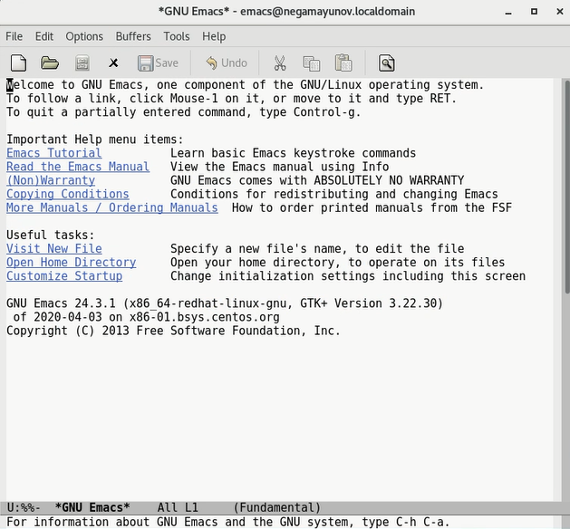

    Рисунок 1.

2. Создал файл `lab07.sh` с помощью комбинации `C-x C-f` *(рисунок 2)*

    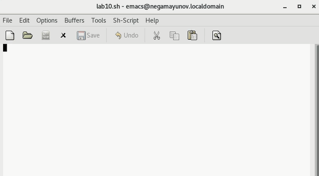

    Рисунок 2.

3. Набрал текст *(рисунок 3)*

    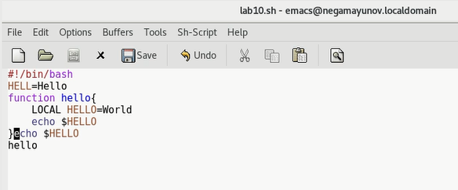

    Рисунок 3.

4. Сохранил файл с помощью комбинации `(C-x C-s)` *(рисунок 4)*

    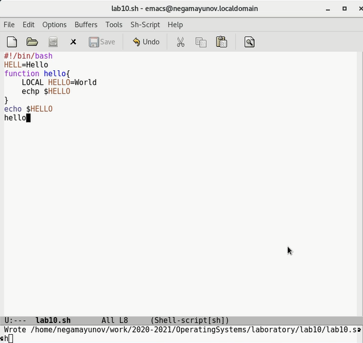

    Рисунок 4.

5. Проделал с текстом стандартные процедуры редактирования:
   - Вырезал одной командой целую строку - `(С-k)` *(рисунок 5)*

     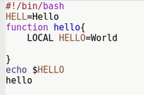

        Рисунок 5.

    - Вставил эту строку в конец файла - `(C-y)` *(рисунок 6)*

        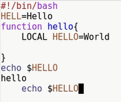

         Рисунок 6.

    - Выделил область текста `(C-Space)` *(рисунок 7)*

        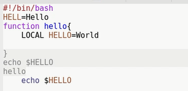

         Рисунок 7.

    - Скопировал область в буфер обмена `(M-w)`
    - Вставил область в конец файла (*рисунок 8)*

        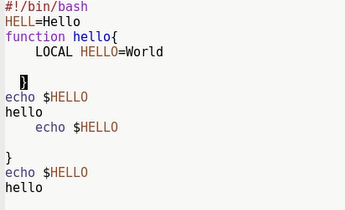

         Рисунок 8.

    - Вновь выделил эту область и на этот раз вырезал её `(C-w)` *(рисунок 9)*

        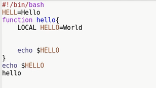

         Рисунок 9.

    - Отменил последнее действие `(C-/)` *(рисунок 10)*

        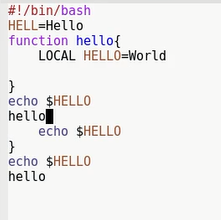

         Рисунок 10.

6. Научился использовать команды по перемещению курсором *(рисунки 11-14)*:
   - Переместил курсор в начало строки `(C-a)`.
    - Переместил курсор в конец строки `(C-e)`.
    - Переместил курсор в начало буфера `(M-<)`.
    - Переместил курсор в конец буфера `(M->)`.

        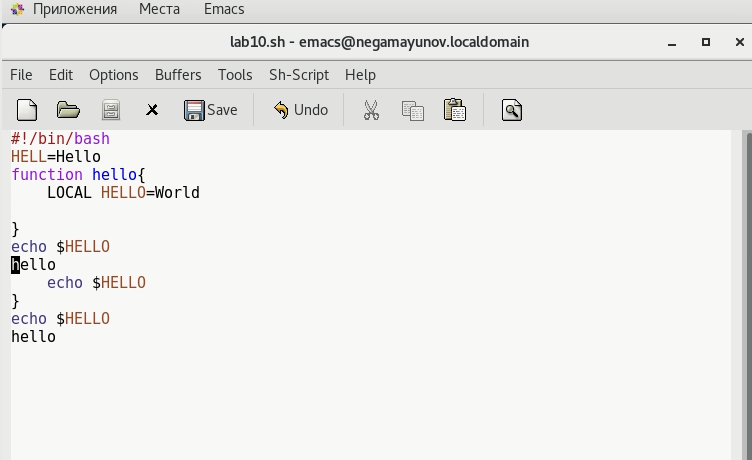

         Рисунок 11.

        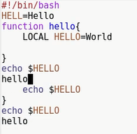

         Рисунок 12.

        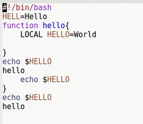

         Рисунок 13.

        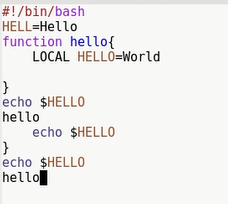

         Рисунок 14.

7. Управление буферами
    - Вывел список активных буферов на экран `(C-x C-b)` *(рисунок 15)*

        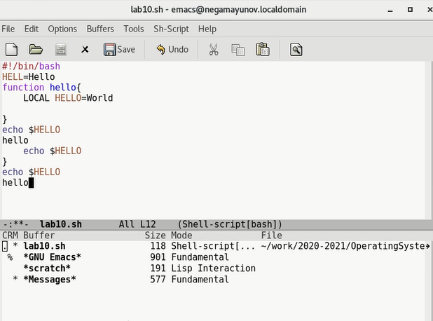

         Рисунок 15.

    - Переместился во вновь открытое окно `(C-x)` со списком открытых буферов и переключился на другой буфер - `Messages` *(рисунок 16)*

        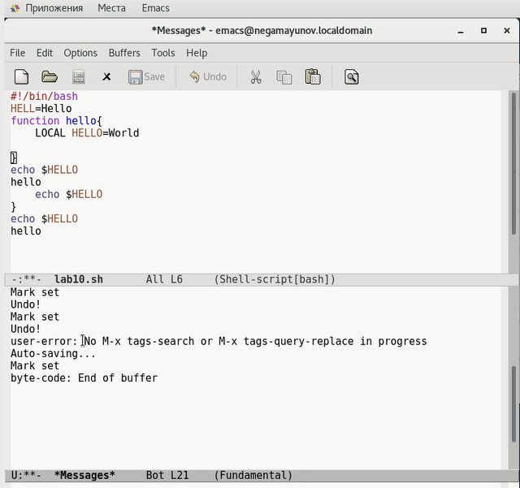

         Рисунок 16.

    - Закрыл это окно `(C-x 0)` *(рисунок 17)*

        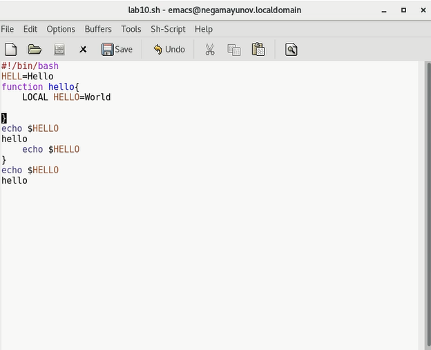

         Рисунок 17.

    - Вновь переключился между буферами, но уже без вывода их списка на экран `(C-x b)` *(рисунок 18)*

        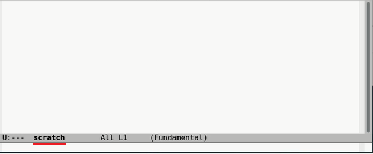

         Рисунок 18.

8. Управление окнами
   - Поделил фрейм на 4 части: разделил фрейм на два окна по вертикали `(C-x 3)`, а затем каждое из этих окон на две части по горизонтали `(C-x 2)` *(рисунок 19)*
  
        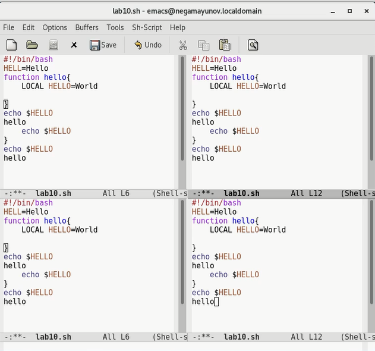

        Рисунок 19.

    - В каждом фрейме открыл новый буфер и написал немного текста *(рисунок 20)*

        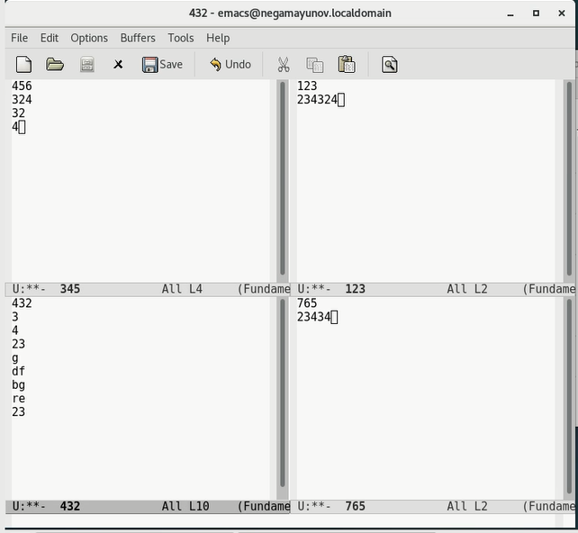

         Рисунок 20.

9. Режим поиска
    - Переключился в режим поиска `(C-s)` и нашел несколько слов, присутствующих в тексте *(рисунок 21)*

        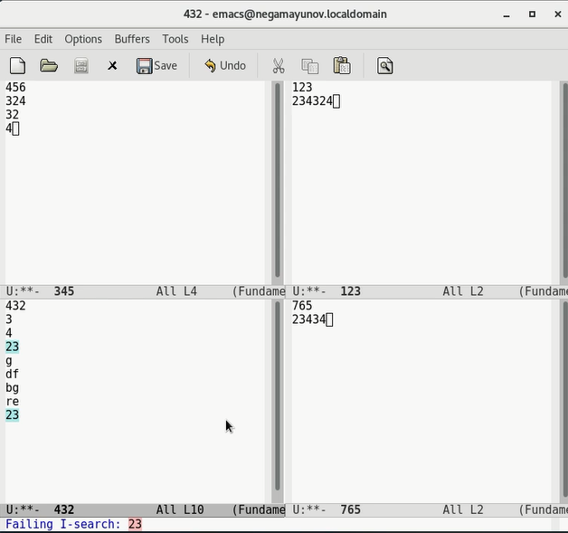

         Рисунок 21.

    - Переключался между разными режимами поиска нажатием `C-s` *(рисунок 22)*

        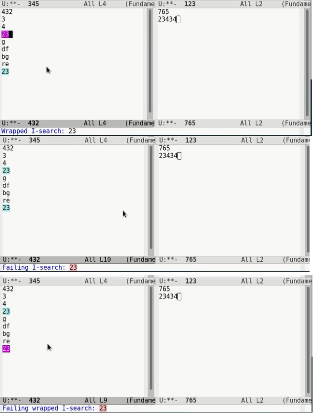

        Рисунок 22.

    - Вышел из режима поиска, нажав `C-g` *(рисунок 23)*

        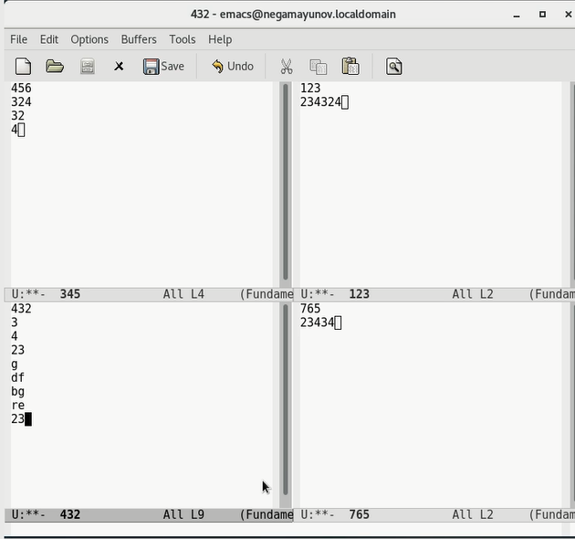

        Рисунок 23.

    - Перешёл в режим поиска и замены, нажав `M-x query-replace`. Заменил hello на world в одном из буферов *(рисунок 24)*

        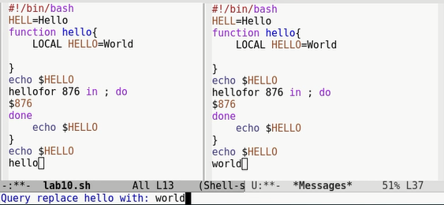

        Рисунок 24.
    
    - С помощью `M-s o` переключился в другой режим поиска и попробовал найти *echo* *(рисунок 25)*

    Сразу заметны различия: если предыдущий способ подсвечивал найденные слова в буфере, то этот выводит результат в отдельный буфер.

    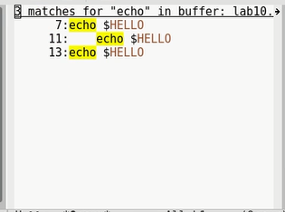

    Рисунок 25.

# Выводы
Я познакомился с операционной системой Linux и получил практические навыки работы с редактором Emacs.

# Контрольные вопросы
1. Emacs представляет собой мощный экранный редактор текста, написанный на языке высокого уровня Elisp.
2. Обилие горячих клавиш и специфически реализованная (по сравнению с vi) работа с буферами и фреймами.
3. `Буфер` - это объект, в котором содержится какой-либо текст и через который производится большинство взаимодействий пользователя с редактором.

    `Окно` - это участок фрейма, содержащий один из буферов.

4. Нет, так как окно отображает только один буфер. А вот отобразить 10 буферов **в одном фрейме** вполне можно.
5. `GNU Emacs`, `Scratch` и `Messages` *(рисунок 26)*

    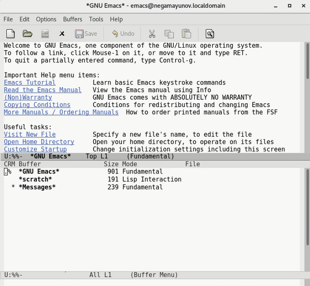

    Рисунок 26.

6. В первом случае: Ctrl+C, а после, отпустив эти клавиши, |.
   Во втором: Ctrl+C, а затем Crtl+|.
7. По горизонтали: `C-x 2`, по вертикали: `C-x 3`.
8. В файле `.emacs`.
9. По умолчанию эта клавиша стирает символ перед курсором. Если изменить файл `.emacs`, её можно будет переназначить.
10. Vi интуитивно гораздо понятнее, это можно заметить хотя бы по времени выполнения мной лабораторных по редактору: emacs занял в три раза больше времени из-за неудобства для новичка и специфики.

# Библиография
- [Кулябов Д. С. и др. Операционные системы. Методические рекомендации к лабораторной работе №10](https://esystem.rudn.ru/pluginfile.php/1142087/mod_resource/content/3/007-lab_emacs.pdf)